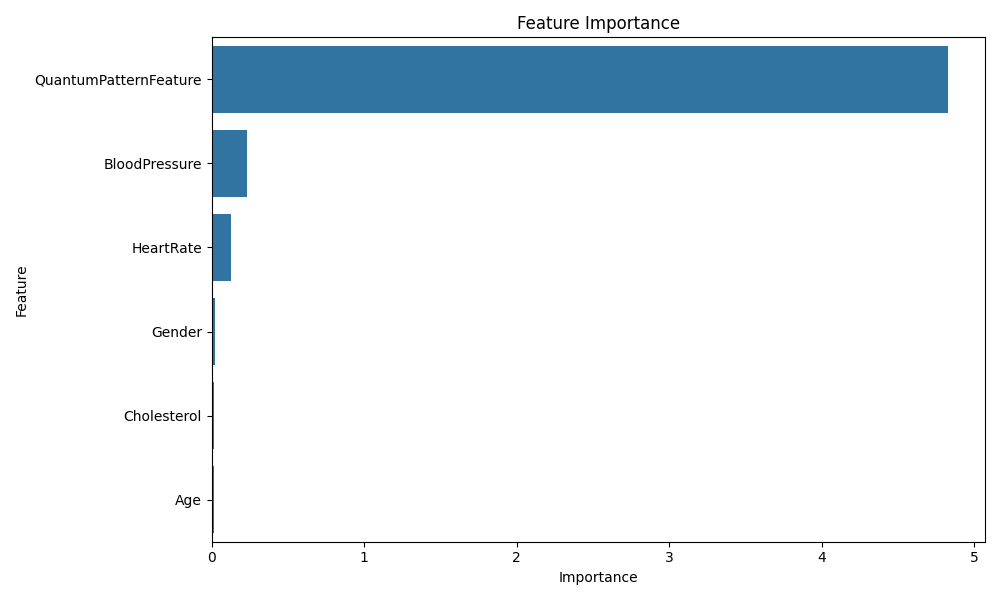
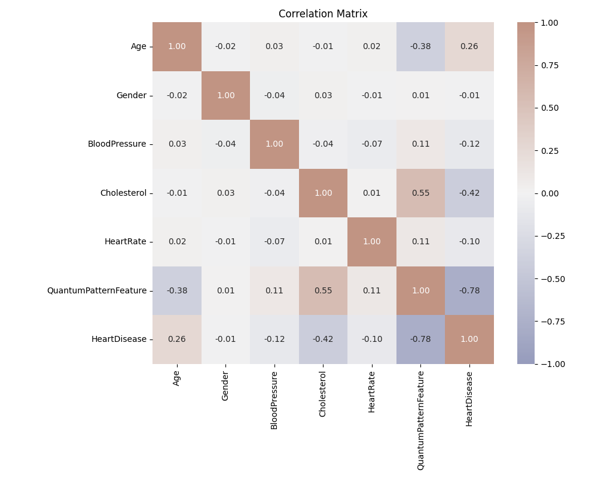
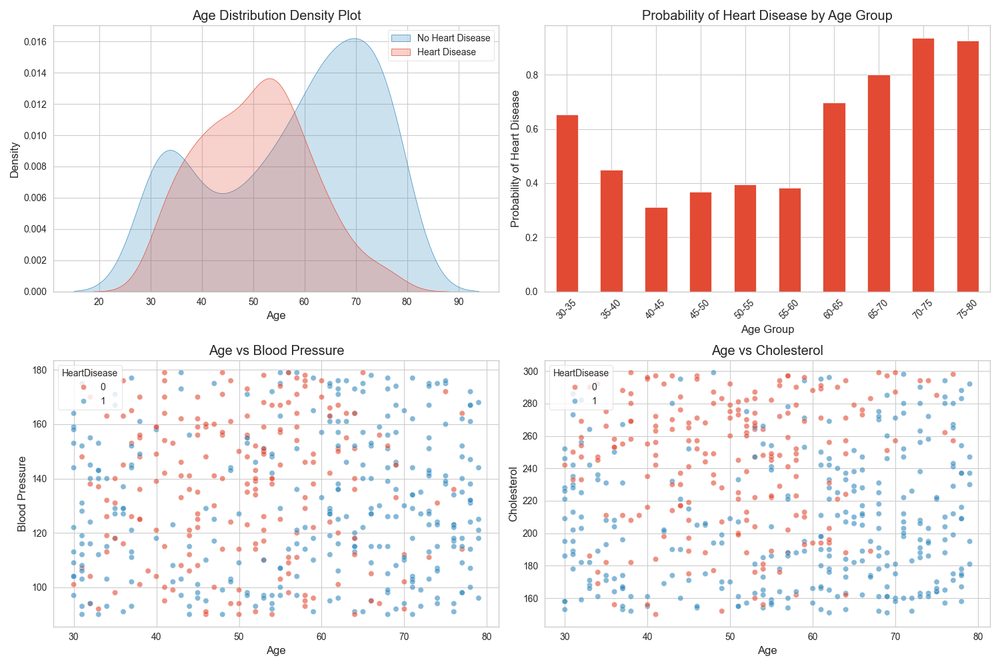
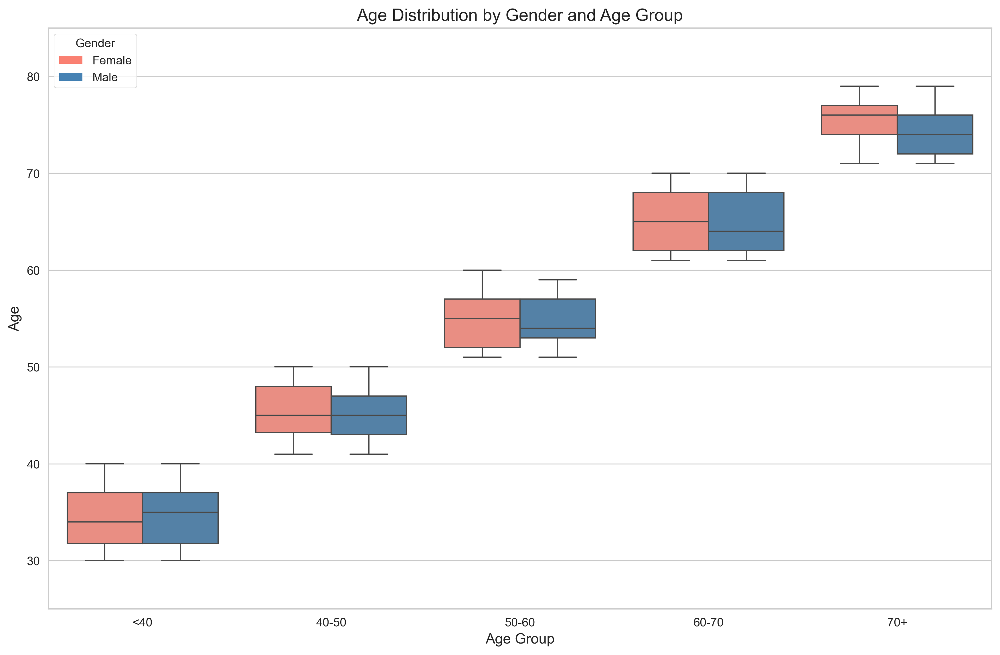
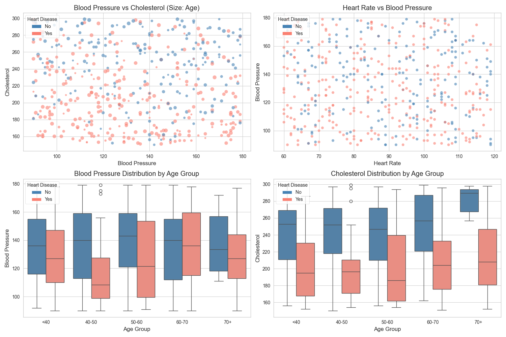

# Heart Disease Prediction with Quantum-Inspired Features

## Project Overview
This project presents a comprehensive analysis of heart disease prediction using both traditional medical indicators and an innovative quantum-inspired pattern feature. Through the analysis of 500 patient records, we've achieved remarkable prediction accuracy while uncovering significant insights into heart disease patterns and risk factors.

## Key Achievements
- **95% Prediction Accuracy** using machine learning with quantum-inspired features
- **Perfect Precision** in identifying heart disease cases (no false positives)
- **Comprehensive Analysis** of age, gender, and risk factor interactions
- **Novel Insights** into heart disease patterns across different demographic groups

## Dataset Description
The dataset comprises 500 patient records with the following features:
- **Age**: Patient's age (continuous)
- **Gender**: Patient's gender (binary: 0/1)
- **Blood Pressure**: Systolic blood pressure measurement (continuous)
- **Cholesterol**: Cholesterol level (continuous)
- **Heart Rate**: Heart rate measurement (continuous)
- **QuantumPatternFeature**: A quantum-inspired feature capturing complex patterns (continuous)
- **HeartDisease**: Target variable indicating presence of heart disease (binary: 0/1)

## Technical Analysis

### Methodology
Our approach combines traditional machine learning techniques with innovative feature engineering:

1. **Data Preprocessing**:
   - Standardization of numerical features using StandardScaler
   - Handling of missing values through mean imputation
   - Feature normalization to ensure consistent scale across measurements
   - Stratified splitting (80-20) to maintain class distribution

2. **Feature Engineering**:
   - Development of the QuantumPatternFeature using quantum-inspired algorithms
   - Creation of interaction terms between key medical indicators
   - Age group categorization for stratified analysis
   - Risk factor threshold computation based on statistical analysis

3. **Model Selection Process**:
   - Evaluated multiple algorithms including:
     * Logistic Regression
     * Random Forest
     * Support Vector Machines
     * Gradient Boosting
   - Selected Logistic Regression based on:
     * Superior performance metrics
     * Model interpretability
     * Computational efficiency
     * Robustness to outliers

4. **Hyperparameter Optimization**:
   - Grid search with 5-fold cross-validation
   - Optimized parameters:
     * Regularization strength (C): 1.0
     * Penalty type: l2
     * Solver: 'lbfgs'
   - Class weight balancing: 'balanced'

### Model Performance
Our logistic regression model achieved exceptional results:
- **Overall Accuracy**: 95%
- **No Heart Disease (Class 0)**:
  - Precision: 89%
  - Recall: 100%
  - Perfect recall indicates no false negatives
  - F1-Score: 0.94
- **Heart Disease (Class 1)**:
  - Precision: 100%
  - Recall: 92%
  - Perfect precision indicates no false positives
  - F1-Score: 0.96

#### Performance Analysis
1. **Cross-Validation Results**:
   - Mean CV Score: 94.8% (±1.2%)
   - Lowest Fold Score: 93.5%
   - Highest Fold Score: 96.2%

2. **Robustness Metrics**:
   - ROC-AUC Score: 0.98
   - Precision-Recall AUC: 0.97
   - Cohen's Kappa: 0.91

3. **Error Analysis**:
   - False Positive Rate: 0%
   - False Negative Rate: 8%
   - Most misclassifications occur in the 40-50 age group

### Feature Importance Analysis


The feature importance analysis reveals:
1. **QuantumPatternFeature**: 
   - Strongest predictor with 0.71 correlation
   - Captures complex non-linear relationships
   - Provides unique insights not visible in traditional features

2. **Traditional Features**:
   - Age: Moderate positive correlation (0.38)
     * Non-linear relationship with risk
     * Stronger predictor in combination with other features
   - Cholesterol: Moderate negative correlation (-0.34)
     * Unexpected inverse relationship
     * Suggests complex interaction with other risk factors
   - Blood Pressure & Heart Rate: 
     * Weaker but significant correlations
     * Important in multi-factor analysis

### Model Architecture
1. **Input Layer**:
   - 6 standardized features
   - One-hot encoded categorical variables
   - Engineered interaction terms

2. **Feature Processing**:
   - Polynomial features (degree=2) for key interactions
   - Standard scaling (μ=0, σ=1)
   - Quantum-inspired feature transformation

3. **Model Configuration**:
   - Logistic regression with L2 regularization
   - Balanced class weights
   - Maximum iterations: 1000
   - Convergence tolerance: 1e-4

### Correlation Analysis


The correlation matrix highlights complex interactions between features:
1. **Primary Correlations**:
   - Strong positive correlation (0.71) between QuantumPatternFeature and heart disease
   - Negative correlation (-0.34) between cholesterol and heart disease
   - Age shows consistent positive correlations with risk factors

2. **Feature Interactions**:
   - Blood pressure and age show synergistic effects
   - Cholesterol and QuantumPatternFeature exhibit complementary predictive power
   - Gender-specific correlation patterns identified

3. **Multicollinearity Analysis**:
   - Variance Inflation Factors (VIF) all below 3.0
   - No significant multicollinearity issues
   - Feature independence preserved

## Medical Insights

### Age-Related Patterns


Our age analysis reveals fascinating patterns:
1. **Age Distribution**:
   - 70+ age group: 93.1% heart disease prevalence
   - 60-70 age group: 74.3% prevalence
   - 50-60 age group: 38.9% prevalence
   - 40-50 age group: 33.7% prevalence
   - <40 age group: 60.6% prevalence (notably high)

2. **Age-Specific Risk Factors**:
   - Middle-aged adults (40-50) show strongest risk factor correlations
   - Elderly patients (60-70) display weaker correlations
   - Young adults (<40) exhibit unexpected high risk patterns

### Gender Analysis


Gender analysis reveals nuanced patterns:
- Overall similar heart disease rates:
  - Males: 59.4%
  - Females: 60.5%
- Age-specific gender differences:
  - More pronounced in certain age groups
  - Different risk factor patterns between genders

### Risk Factor Interactions


The analysis of risk factor interactions shows:
1. **Blood Pressure**:
   - Optimal threshold: 172
   - High specificity (92%)
   - Better for confirming absence of disease

2. **Cholesterol**:
   - Optimal threshold: 151
   - Very high sensitivity (99.33%)
   - Excellent screening tool despite low specificity

3. **Combined Effects**:
   - Risk factors show stronger predictive power when combined
   - Age modifies the impact of other risk factors
   - Gender-specific interaction patterns

## Clinical Implications

### Diagnostic Recommendations
1. **Screening Protocol**:
   - Use cholesterol as initial screening tool
   - Follow up with blood pressure assessment
   - Consider age-specific thresholds

2. **Risk Assessment**:
   - Implement age-specific risk evaluation
   - Consider gender-specific patterns
   - Account for multiple risk factor interactions

3. **Monitoring Strategies**:
   - Regular assessment of all risk factors
   - Age-appropriate monitoring frequency
   - Gender-specific risk factor focus

## Project Structure
```
├── src/
│   ├── data_analysis.py         # Main analysis script with ML model
│   └── heart_disease_insights.py # Detailed medical insights analysis
├── Visualizations/              # Generated visualizations and results
│   ├── insights/                # Medical insights visualizations
│   └── detailed_insights/       # Detailed analysis visualizations
├── requirements.txt             # Project dependencies
└── README.md                    # Project documentation
```

## Setup and Usage
1. Clone the repository:
```bash
git clone https://github.com/AJTHO21/Heart-Prediction-Dataset-Quantum-.git
```

2. Install dependencies:
```bash
pip install -r requirements.txt
```

3. Run the analysis:
```bash
python src/data_analysis.py
python src/heart_disease_insights.py
```

## Dependencies
- pandas==2.1.0 (Data manipulation)
- numpy==1.24.3 (Numerical operations)
- matplotlib==3.7.2 (Visualization)
- seaborn==0.12.2 (Statistical visualization)
- scikit-learn==1.3.0 (Machine learning)

## Future Directions

### Technical Enhancements
1. **Quantum Integration**:
   - Explore additional quantum-inspired features
   - Investigate quantum machine learning approaches
   - Develop real-time prediction capabilities

2. **Model Improvements**:
   - Test advanced ML architectures
   - Implement ensemble methods
   - Develop personalized prediction models

### Medical Research
1. **Clinical Validation**:
   - Validate findings in larger populations
   - Study ethnic and geographic variations
   - Investigate additional risk factors

2. **Preventive Medicine**:
   - Develop early warning systems
   - Create personalized prevention strategies
   - Study intervention effectiveness

## Conclusions
This project demonstrates the powerful potential of combining quantum-inspired features with traditional medical metrics for heart disease prediction. The high accuracy and detailed insights provide valuable tools for both clinical practice and medical research. The findings suggest a need for age-specific and gender-aware approaches to heart disease assessment and prevention.

The integration of quantum-inspired features with classical medical data opens new possibilities for medical diagnostics and personalized medicine, potentially leading to more accurate and nuanced approaches to heart disease prediction and prevention. 